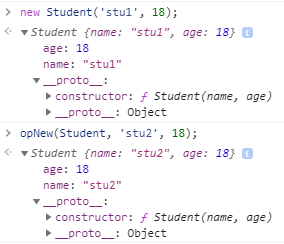

# prototype

#### 主要内容

## 链表

在C/C++有指针的概念，指针就是一个存放在内存地址的变量，通过指针指向的地址，计算机可以找到对应的内容。在这个基础上出现了一个基本的数据结构：链表

```c
struct LinkNode
{
  int value;
  struct LinkNode* next;
}
```

链表是一类线性表，和数组不同的是，链表的每一个节点物理地址不是连续的，只有通过`next`才能找到下一个节点，虽然这种结构导致查找节点数据比数组慢，但是链表对于插入、删除等操作具有数组无法比拟的优势。

js中不存在指针的概念，但是js中对象的存储方式和指针很像，变量只是保存了对象的地址，所以说对象是引用的。借此，js实现链表这种结构就来的非常简单轻松了

```js
const linkList = {
  value: 1,
  next: {
    value: 2,
    next: null,
  },
}

const node = linkList.next;
```

是不是和js的`prototype`有点类似了，如果把`linkList`中的`next`属性改名为`__proto__`，是不是更像我们在浏览器console里面看到的对象结构了

## 原型

总所周知，js是一门基于原型的面向对象语言。

其实对象的原型就是通过某种方式链接在该对象上的对象而已。对于普通对象，我们可以使用`Object.create`来进行原型的链接

> `Object.create`详情[前往MDN](https://developer.mozilla.org/zh-CN/docs/Web/JavaScript/Reference/Global_Objects/Object/create)阅读

```js
// 这种方式会创建一个完全的空对象，没有任何属性，也没有默认的原型，这样作为手动链接的终点原型
const endProto = Object.create(null);
endProto.value = 'end of proto';

const proto1 = Object.create(endProto);
proto1.value = 'this a proto too';

const obj = Object.create(proto1);
obj.value = 'obj';

// 因为创建的 endProto 没有链接到Object.prototype，所以这几个对象不存在任何方法
Object.isPrototypeOf.call(proto1, obj); // true
Object.isPrototypeOf.call(endProto, obj); // true
```

可以看到，对象的原型就是一个普通的对象，当被隐式的链接到另一个对象上时，就成为了另一个对象的原型

> 另一个修改原型的方法是`Object.setPrototypeOf`，详情请查看[MDN](https://developer.mozilla.org/zh-CN/docs/Web/JavaScript/Reference/Global_Objects/Object/setPrototypeOf)

## 原型链

上面我们通过`Object.create`将三个对象链接在一起，构成了一个链式结构，就是原型链。

原型链最大的好处就是我们可以非常方便的借用其他对象的方法与属性。

```js
const arr = [];
arr.push(1);
```

平时普通声明的对象、数组之类的都自动链接到对应的原型上，所以我们能直接在数组上调用`push`方法。

在对象上取属性时，如果本身不存在这个属性，引擎就会自动沿着这条链向上查找，直到找到同名属性或者到达终点（null）

> 像`number`，`string`之类的基本类型也可以直接调用对应内置对象上的方法，其中涉及到`装箱`，`拆箱`的操作，引擎会自动将原始值转为对应的封装对象，然后就可以调用对应的方法了

## new

总所周知，js里面是没有构造函数的，只有构造函数调用，也就是将普通函数通过`new`来调用

`new`调用过程中，会在函数内部生成一个对象，并让`this`指向这个对象，并且进行原型链接，然后执行函数体，如果函数有自己的返回值，就返回对应的返回值，如果没有就返回`this`指向的对象

```js
function opNew(fn, ...params) {
  const obj = {};
  const res = fn.call(obj, ...params);
  Object.setPrototypeOf(obj, fn.prototype);
  return res || obj;
}

function Student(name, age) {
  this.name = name;
  this.age = age;
}

const stu1 = new Student('stu1', 18); // Student {name: "stu1", age: 18}
const stu2 = opNew(Student, 'stu2', 18); // Student {name: "stu2", age: 18}
```

最后效果：



## instanceof

js的`instanceof`本质上也是进行原型链查找

> MDN：[`instanceof`运算符用于检测构造函数的`prototype`属性是否出现在某个实例对象的原型链上](https://developer.mozilla.org/zh-CN/docs/Web/JavaScript/Reference/Operators/instanceof)。

```js
const stu = opNew(Student, 'stu2', 18);
stu instanceof Student; // true
Object.setPrototypeOf(stu, Array.prototype);
stu1 instanceof Array; // true
```

简单实现

```js
function instanceOf(left, right) {
  if (typeof right !== 'function') {
    throw new TypeError('err');
  }
  const target = Object.getPrototypeOf(left);
  let proto = right.prototype;
  while (proto) {
    if (target === proto) return true;
    proto = Object.getPrototypeOf(proto);
  }
  return false;
}
instanceOf(stu, Student); // true
```

## 原型继承（TODO）

> ##
> ### 如有错误，欢迎批评指正
> ##