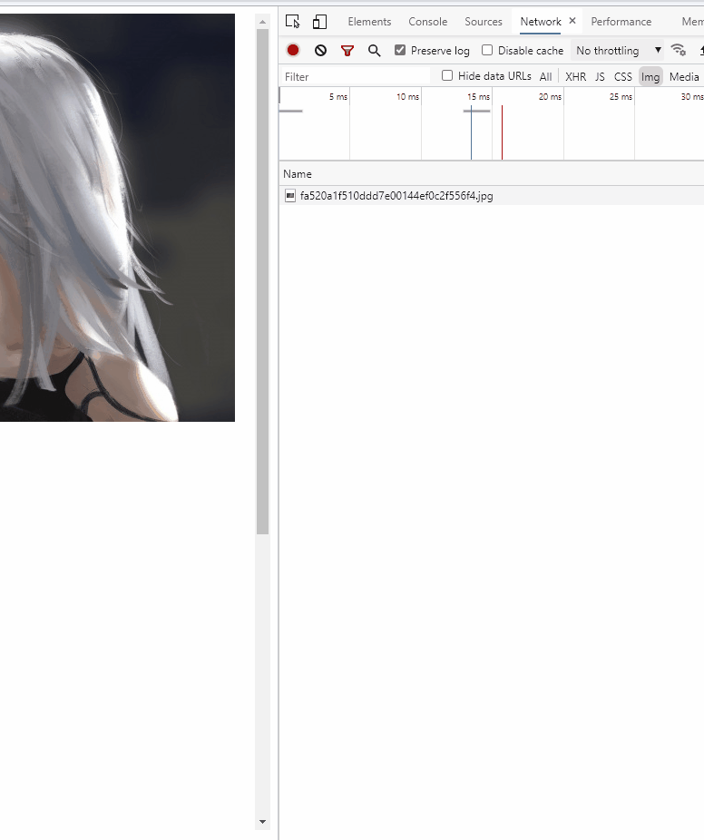

# 懒加载

### 主要内容

1. 介绍一下懒加载
2. 简单实现

## 懒加载

主要指页面图片的懒加载，页面性能优化的方式之一。

当页面存在大量图片的时候就可以使用懒加载，将不可见的图片延迟加载。

第一次加载时只加载可见的图片，然后监听页面的滚动事件，判断图片元素``是否进入可视区域。

如果进入，就创建一个`Image`对象用来加载对应的图片，同时在这个对象上监听加载事件，更新页面的状态（比如展示`loading` `error`）

## 简单实现

效果：



1. 判断元素是否可见

`getBoundingClientRect()` （[详情请前往MDN](https://developer.mozilla.org/zh-CN/docs/Web/API/Element/getBoundingClientRect)）方法返回元素的大小及其相对于视口的位置，使用这个方法获取对应元素相对父元素的位置

```js
// 这里只简单进行Y轴的判断
// 当target的top值小于其父元素的高度，这里就认为以及进入可视区域
function isView(target) {
  const parent = target.parentNode || document.body;

  const { offsetHeight: pH } = parent;
  const { top } = target.getBoundingClientRect();
  return top < pH;
}
```

2. 加载图片

这里的实现是直接监听父元素的`scroll`事件，通过元素上的`dataset`属性来简单展示图片的加载状态

完整代码见 `/code/lazy.html`

```js
function lazy(target, value) {
  const parent = target.parentNode || document.body;

  const handleScroll = () => {
    if (!isView(target)) return;
    if (target.dataset.state !== 'unload') return;

    target.dataset.state = 'loading';
    const img = new Image();
    img.src = value;
    img.addEventListener('load', () => {
      target.src = value;
      target.dataset.state = 'success';
      parent.removeEventListener('scroll', handleScroll);
    });
  }

  parent.addEventListener('scroll', handleScroll);
  // 手动调用一次，初始判断页面第一次渲染时是否需要加载图片
  handleScroll();
}
```

> 更好的实现可以使用 `IntersectionObserver` api
> 该api提供了效果更好的监听，当元素可见比例超过指定阈值后，会调用一个回调函数
> 详情请查看[MDN](https://developer.mozilla.org/zh-CN/docs/Web/API/IntersectionObserver/IntersectionObserver)

> ##
> ### 如有错误，欢迎批评指正
> ##
